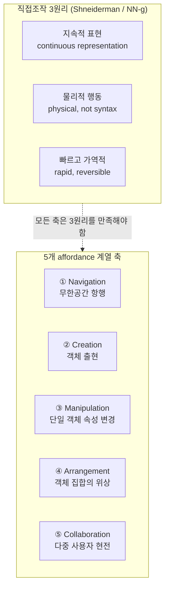
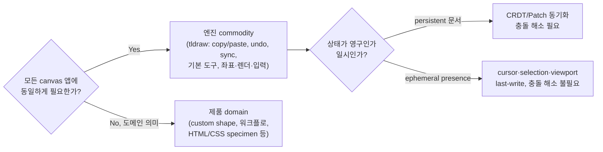

# Canvas Affordance De-facto 표준

> 정본(canonical reference). 이 repo가 "다 했다"를 판단하는 기준은 자체 제작 inventory가
> 아니라 **이 문서의 de-facto 어휘**다. `docs/affordance-inventory.md`의 keep/legacy/drop은
> 이 분류 축으로 대체·재해석한다.

## TL;DR

- canvas 편집기 affordance는 **5개 계열 축**으로 묶인다: **Navigation · Creation · Manipulation · Arrangement · Collaboration**. (Figma/FigJam/Miro/Canva/tldraw/Excalidraw 공통 + infinite-canvas/Shneiderman 합성)
- 각 affordance는 **필수 / 보편 / 선택** 3단계 완성도로 분류한다. "필수+보편"을 5축 전부에서 채우는 것이 곧 "엔진으로 성립"의 정의다.
- "keep vs legacy"가 아니라 **엔진-commodity vs 제품-domain**, 그리고 **persistent(문서) vs ephemeral(presence)** 이 진짜 경계다. HTML/CSS specimen은 *legacy*가 아니라 axis 2·3의 *제품-domain* 기능일 뿐이다.
- 이 repo는 5축 코어를 거의 다 가졌다. **진짜 갭**은: flip, zoom-to-selection, image/SVG export, tidy-up(2D auto-arrange), 그리고 (의도적 out-of-scope일 수 있는) **실 multiplayer sync 엔진**.

## Why — 왜 이 기준이 지금 필요한가

`docs/figjam-pareto-progress.md`의 이슈 #10~#31이 전부 Closed이고 GitHub 열린 이슈가 0이다. 그래서 에이전트는 "할 게 없다"고 결론낸다. 그러나 "Done"의 근거가 **유닛 테스트 그린 + 버튼 렌더(presence e2e)**였고, 완료 판단의 yardstick이 **자체 제작 `affordance-inventory.md`**였다. 외부 권위 기준이 없으니 "다 했다"는 곧 "내가 만든 체크박스를 다 채웠다"였다 — 이것이 가짜 Done의 구조다.

de-facto 표준을 정본으로 세우면, 완료는 "내 목록 소진"이 아니라 **"표준 어휘의 필수+보편 칸을 5축 전부에서 채웠는가"**가 된다. 빈 칸이 곧 goal이다.

## How — de-facto 분류 틀

5개 기능 축(가로) × Shneiderman 직접조작 3원리(세로)의 행렬로 affordance를 좌표화한다.

엔진/제품 경계는 두 권위 원천이 같은 선을 가리킨다.

> 근거: tldraw가 "commodity work"로 명명한 엔진 영역, Figma가 document-sync와 presence를 **별도 시스템**으로 분리한 결정, Yjs awareness의 persistent vs ephemeral 경계 — 셋이 동일한 분류선을 지지한다.

## What — 표준 affordance 표 × repo 현황 매핑

판정: **필수**=없으면 canvas 편집기로 성립 불가 / **보편**=de-facto 거의 모든 제품 제공 / **선택**=제품 성격 의존.
repo: ✅ 보유 · ⚠️ 부분 · ❌ 갭. (repo 보유 근거: `CanvasAffordanceCatalog.ts` tools/commands + `affordance-inventory.md` Keep + e2e)

### ① Navigation
| Affordance | 등급 | repo | 비고 |
|---|---|---|---|
| Pan | 필수 | ✅ | `pan` tool + temporary pan |
| Zoom in/out/reset | 필수 | ✅ | `zoomIn/zoomOut/zoomReset` |
| Zoom to fit | 보편 | ✅ | `fitView` |
| **Zoom to selection** | 보편 | ❌ | Figma `Shift 2`, Miro `Cmd 2` — 없음 |
| Minimap | 선택 | ❌ | Miro 특유, 보류 가능 |

### ② Creation
| Affordance | 등급 | repo | 비고 |
|---|---|---|---|
| Shape (rect/ellipse) | 필수 | ✅ | `rect`/`ellipse` + `diamond` |
| Text | 필수 | ✅ | `text` |
| Freehand draw | 보편 | ✅ | `marker`/`highlight` + `eraser` |
| Image | 보편 | ✅ | image object |
| Sticky note | 필수(whiteboard) | ✅ | `sticky` + quick-create |
| Connector/arrow | 필수(whiteboard) | ✅ | `arrow` + 스냅 attach + elbow/straight |
| Frame/Section | 보편 | ✅ | `section` |
| **Line (arrow와 별개)** | 보편 | ⚠️ | arrow는 있으나 plain line 미분리 (tldraw/Excalidraw는 별 도구) |
| **Vector pen (bezier path)** | 보편 | ❌ | Figma pen, tldraw/Excalidraw — 없음 (freehand만) |
| Table / Kanban / Link / Checklist | 선택(제품) | ✅ | custom component로 보유(제품-domain) |
| Stamp | 선택 | ✅ | reaction stamp |

### ③ Manipulation
| Affordance | 등급 | repo | 비고 |
|---|---|---|---|
| Move / nudge | 필수 | ✅ | drag + `nudge` |
| Resize | 필수 | ✅ | resize handles |
| Constrain proportion (aspect lock) | 보편 | ✅ | `CanvasBoundsResize` aspect lock |
| Rotate | 보편 | ✅ | rotation v1 (지원 leaf만) |
| **Flip H/V** | 보편 | ✅ | `flipCanvasSelection`(위치·points·rotation 반사) + demo Flip H/V 버튼 (#33) |
| Style edit (fill/stroke) | 필수 | ✅ | fill/stroke color |
| Text edit (inline) | 필수 | ✅ | text editing |

### ④ Arrangement
| Affordance | 등급 | repo | 비고 |
|---|---|---|---|
| Single / marquee select | 필수 | ✅ | `select` + marquee |
| Multi-select (additive) | 필수 | ✅ | shift-click |
| Nested / deep select | 보편 | ✅ | direct nested selection |
| Align (6-way) | 필수 | ✅ | `alignLeft..alignBottom` |
| Distribute (h/v) | 보편 | ✅ | `distributeHorizontal/Vertical` |
| Z-order (4-way) | 필수 | ✅ | `bringForward..sendToBack` |
| Group / ungroup | 필수 | ✅ | `group`/`ungroup` |
| Lock / unlock | 보편 | ✅ | `lockSelection`/`unlockAll` |
| Snap grid + smart guides | 보편 | ✅ | snap engine: grid/alignment/spacing |
| **Tidy up (2D auto-arrange)** | 보편 | ❌ | Figma/Canva tidy-up — align/distribute는 있으나 2D 격자 정돈 없음 |
| Select-same (type) | 선택 | ✅ | `selectSameTypeCanvasSelection` + demo 'Select same type' (#37). fill/stroke 변형은 후순위 |

### ⑤ Collaboration / Presence
| Affordance | 등급 | repo | 비고 |
|---|---|---|---|
| Presence cursors | 보편(협업) | ⚠️ | presence **prop 표시**만, 실 sync 엔진 없음 |
| Comments | 필수(협업) | ✅ | comment item + attach |
| Reactions / stamps / emote | 보편 | ✅ | stamp + emote burst |
| Cursor chat | 보편 | ✅ | cursor chat transient |
| Voting | 선택 | ✅ | voting session |
| Timer | 선택 | ✅ | session timer |
| Spotlight / follow | 보편(협업) | ⚠️ | spotlight 있음, follow-view 동기화는 미확인 |
| **실 multiplayer sync (CRDT/socket)** | 보편(협업 제품) | ❌ | host가 데이터 소유. 실 동기화 엔진 부재 — *의도적 out-of-scope일 수 있음* |

### 엔진 cross-cutting (계열 무관 table-stakes)
| Affordance | 등급 | repo | 비고 |
|---|---|---|---|
| Copy/paste/cut/duplicate | 필수 | ✅ | clipboard commands |
| Undo / redo | 필수 | ✅ | history |
| Delete | 필수 | ✅ | `delete` |
| Command palette | 보편 | ✅ | `commandPalette` overlay |
| Context command menu | 보편 | ✅ | context menu |
| Keyboard shortcut grammar | 필수 | ✅ | feature-toggle별 shortcut |
| **Image/SVG/PNG export** | 보편 | ✅ | `CanvasImageExportSvg`(전 item SVG) + SVG→PNG 래스터 download. demo 'Export selection as image' 버튼 (#36) |
| Keyboard shortcut help (Shift+/) | 선택 | ❌ | tldraw/Excalidraw 보유, 보류 가능 |
| Dark mode toggle | 선택 | ✅ | demo `<main data-theme>` 토글, 기존 dark 토큰 재사용 (#38) |

## What-if — 이 기준을 repo에 적용하면

1. **`affordance-inventory.md` 재해석.** keep/legacy/drop → 각 항목을 (계열 축 × 엔진/제품 × persistent/ephemeral)로 재태깅. "HTML/CSS specimen=legacy"는 "axis 2·3 제품-domain 기능, 기본 데모에서 미노출"로 정정 — 폐기가 아니라 위치 지정.
2. **갭이 곧 goal.** 위 ❌가 재오픈할 실제 이슈다:
   - 보편 갭(우선): **flip H/V**, **zoom-to-selection**, **image/SVG export**, **tidy-up**.
   - 보편 갭(아키텍처 결정 필요): **실 multiplayer sync** — host-owns-data 원칙과 충돌하므로 "엔진 out-of-scope" 명시 or presence sync seam 설계. *결정이 필요한 항목.*
   - 선택 갭(후순위): vector pen, line 분리, select-same, shortcut help, dark toggle.
3. **DoD 격상.** "버튼 렌더 + 유닛 그린" → "해당 affordance가 표준 동작(이 문서의 인용 동작)대로 running 앱에서 작동". presence e2e를 behavioral e2e로 보강.

## 흥미로운 이야기

Figma 멀티플레이어는 출시 당시 "controversial"했다 — OT/CRDT가 "필요 이상으로 복잡하다"며 거부하고, 문서 동기화와 presence를 **다른 시스템**으로 쪼갰다. 핵심은 presence(cursor·selection·viewport 삼중쌍)는 각 클라이언트가 자기 것만 소유해 **충돌 해소가 아예 불필요**하다는 점 — 그래서 구현 비용이 문서 동기화보다 압도적으로 낮았다. Yjs가 이를 `awareness` CRDT로 일반화하며 "cursor/user" 필드가 사실상 표준 어휘가 됐다. 이 repo가 presence를 document item이 아니라 runtime overlay state로 둔 것(`CanvasApp` presence prop)은 — 의식했든 아니든 — **정확히 이 de-facto 경계를 따른 설계**다.

## Insight

이 repo의 affordance 엔진은 de-facto 코어(5축의 필수+보편)를 **이미 80%+ 충족**한다. 문제는 기능 부족이 아니라 **기준의 부재**였다 — 자체 inventory가 외부 권위와 정합하지 않아 "어디까지가 끝인지"를 측정할 자가 없었고, 그래서 닫힌 이슈가 곧 완료로 둔갑했다.

**스코프 정합성 판정: 부분 충돌.** de-facto는 multiplayer sync·export를 엔진 commodity로 보지만, 이 repo는 (a) host-owns-data, (b) headless 지향, (c) DOM/CSS export 제거라는 의도적 결정을 가졌다. 따라서 sync와 export는 "표준이니 무조건 구현"이 아니라 **명시적 in/out-of-scope 결정**으로 처리해야 한다. 나머지 보편 갭(flip, zoom-to-selection, tidy-up)은 의도적 거부 근거가 없으므로 곧바로 goal 후보다.

다음 goal의 올바른 형태: *"de-facto 5축의 필수+보편 칸 중 의도적 out-of-scope를 제외한 빈 칸(flip, zoom-to-selection, image export, tidy-up)을 behavioral DoD로 채운다."*

## 출처

**제품 (공식 help/docs)**
- [Figma — Adjust zoom and view](https://help.figma.com/hc/en-us/articles/360041065034) / [Select layers](https://help.figma.com/hc/en-us/articles/360040449873) / [Resize, rotate, flip in FigJam](https://help.figma.com/hc/en-us/articles/1500006206242) / [Connectors](https://help.figma.com/hc/en-us/articles/1500004414542) / [Run meetings](https://help.figma.com/hc/en-us/articles/8538436879767)
- [Miro — Working with objects](https://help.miro.com/hc/en-us/articles/360017730953) / [Collaboration tools](https://help.miro.com/hc/en-us/articles/4402396215698) / [Shortcuts](https://help.miro.com/hc/en-us/articles/360017731033)
- [Canva — Moving elements](https://www.canva.com/help/moving-elements/) / [Group, layer, align](https://www.canva.com/help/layer-group-align/) / [Keyboard shortcuts](https://www.canva.com/help/canva-keyboard-shortcuts/)
- [tldraw — Tools](https://tldraw.dev/sdk-features/tools) / [Actions](https://tldraw.dev/sdk-features/actions) / [Shapes](https://tldraw.dev/docs/shapes)
- [Excalidraw shortcuts](https://csswolf.com/excalidraw-keyboard-shortcuts-pdf/) / [Libraries](https://libraries.excalidraw.com/)

**분류·원리**
- [NN/g — Direct Manipulation](https://www.nngroup.com/articles/direct-manipulation/) (Shneiderman 3원리)
- [What is an Infinite Canvas](https://infinitecanvas.cc/guide/what-is-an-infinite-canvas) / [infinitecanvas.tools](https://infinitecanvas.tools/)
- [Figma blog — How multiplayer works](https://www.figma.com/blog/how-figmas-multiplayer-technology-works/) (document vs presence)
- [Yjs — Awareness & Presence](https://docs.yjs.dev/api/about-awareness) (persistent vs ephemeral)

**한계**: "5축 분류"는 단일 권위 문헌의 직접 인용이 아니라 위 원천들의 합성이다. 제품별 단축키 키바인딩은 UI 개정에 따라 변할 수 있으니 구현 전 최신 공식 표 재확인 권장. Miro/Canva 일부 페이지는 봇 차단(403)으로 검색 색인 발췌에 근거함.
